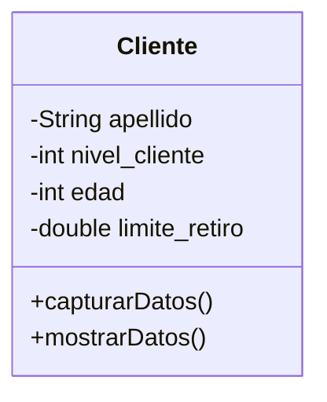

# Modelado de clase cliente

```mermaid
classDiagram
    Cliente: -String apellido
    Cliente: -int nivel_cliente
    Cliente: -int edad
    Cliente: -double limite_retiro
    Cliente: +capturarDatos()
    Cliente: +mostrarDatos()
```
